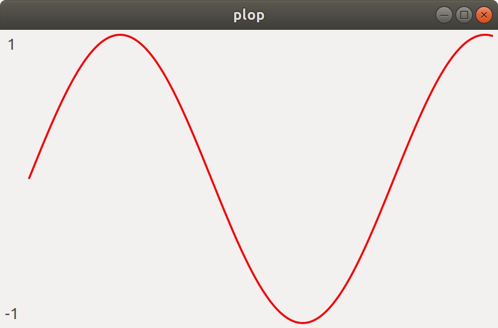
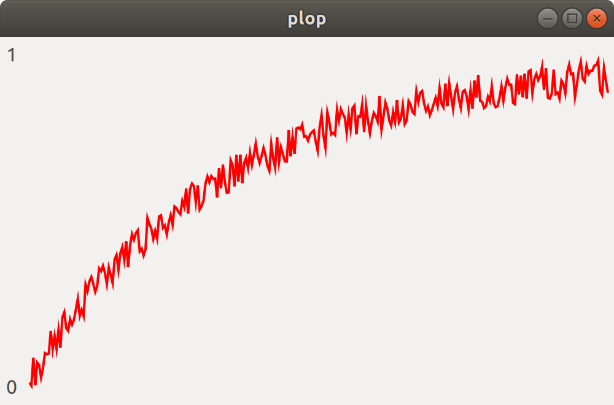
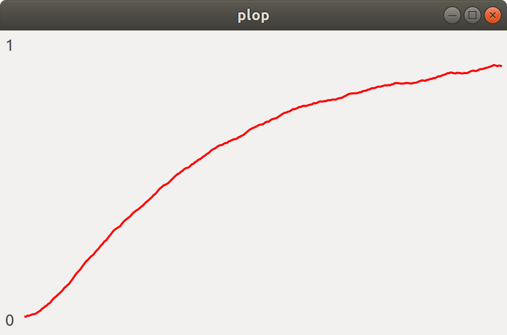

# plop

**plop** is an incredibly simple GUI plotting program. It takes y-axis values from standard input, and displays them in a plot.

# Installation

Install some dependencies:

```
sudo apt install -y libgtk-3-dev valac
```

Then compile the binary:

```
make
```

This will produce `./build/plop`. You can move this into your path if you like.

# Usage

Simply pipe numerical data into the plop command, where each line is a y-axis value. For example:

```
$ cat examples/sin.txt | ./build/plop
```



The plop command can also perform smoothing via an exponential moving average. For example, look at the plot of `examples/noisy_exp.txt`:

```
$ cat examples/noisy_exp.txt | ./build/plop
```



You can smooth this plot out using the `--smooth` option:

```
cat examples/noisy_exp.txt | ./build/plop --smooth 0.95
```


